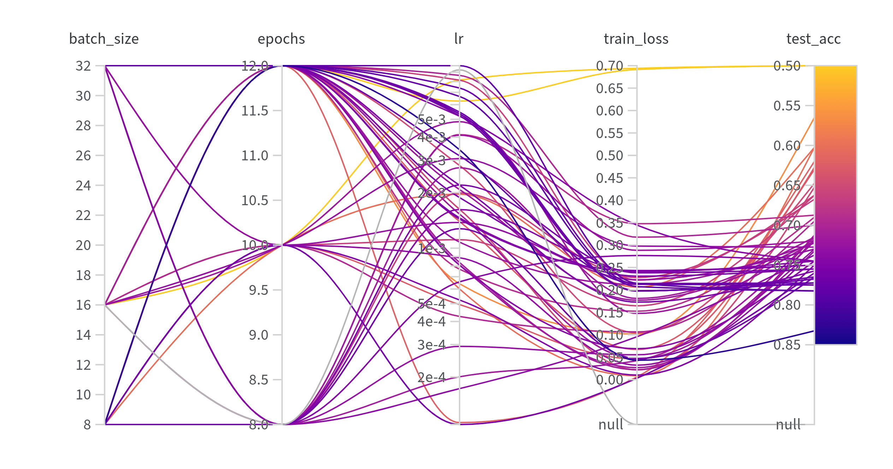

# Exam template for 02476 Machine Learning Operations

This is the report template for the exam. Please only remove the text formatted as with three dashes in front and behind
like:

```--- question 1 fill here ---```

Where you instead should add your answers. Any other changes may have unwanted consequences when your report is
auto-generated at the end of the course. For questions where you are asked to include images, start by adding the image
to the `figures` subfolder (please only use `.png`, `.jpg` or `.jpeg`) and then add the following code in your answer:

```markdown

```

In addition to this markdown file, we also provide the `report.py` script that provides two utility functions:

Running:

```bash
python report.py html
```

Will generate a `.html` page of your report. After the deadline for answering this template, we will auto-scrape
everything in this `reports` folder and then use this utility to generate a `.html` page that will be your serve
as your final hand-in.

Running

```bash
python report.py check
```

Will check your answers in this template against the constraints listed for each question e.g. is your answer too
short, too long, or have you included an image when asked. For both functions to work you mustn't rename anything.
The script has two dependencies that can be installed with

```bash
pip install typer markdown
```

## Overall project checklist

The checklist is *exhaustive* which means that it includes everything that you could do on the project included in the
curriculum in this course. Therefore, we do not expect at all that you have checked all boxes at the end of the project.
The parenthesis at the end indicates what module the bullet point is related to. Please be honest in your answers, we
will check the repositories and the code to verify your answers.

### Week 1

* [x] Create a git repository (M5)
* [x] Make sure that all team members have write access to the GitHub repository (M5)
* [x] Create a dedicated environment for you project to keep track of your packages (M2)
* [x] Create the initial file structure using cookiecutter with an appropriate template (M6)
* [x] Fill out the `data.py` file such that it downloads whatever data you need and preprocesses it (if necessary) (M6)
* [x] Add a model to `model.py` and a training procedure to `train.py` and get that running (M6)
* [x] Remember to fill out the `requirements.txt` and `requirements_dev.txt` file with whatever dependencies that you
    are using (M2+M6)
* [x] Remember to comply with good coding practices (`pep8`) while doing the project (M7)
* [x] Do a bit of code typing and remember to document essential parts of your code (M7)
* [x] Setup version control for your data or part of your data (M8)
* [x] Add command line interfaces and project commands to your code where it makes sense (M9)
* [x] Construct one or multiple docker files for your code (M10)
* [x] Build the docker files locally and make sure they work as intended (M10)
* [x] Write one or multiple configurations files for your experiments (M11)
* [x] Used Hydra to load the configurations and manage your hyperparameters (M11)
* [ ] Use profiling to optimize your code (M12)
* [x] Use logging to log important events in your code (M14)
* [x] Use Weights & Biases to log training progress and other important metrics/artifacts in your code (M14)
* [x] Consider running a hyperparameter optimization sweep (M14)
* [x] Use PyTorch-lightning (if applicable) to reduce the amount of boilerplate in your code (M15)

### Week 2

* [x] Write unit tests related to the data part of your code (M16)
* [x] Write unit tests related to model construction and or model training (M16)
* [x] Calculate the code coverage (M16)
* [x] Get some continuous integration running on the GitHub repository (M17)
* [x] Add caching and multi-os/python/pytorch testing to your continuous integration (M17)
* [x] Add a linting step to your continuous integration (M17)
* [x] Add pre-commit hooks to your version control setup (M18)
* [ ] Add a continues workflow that triggers when data changes (M19)
* [ ] Add a continues workflow that triggers when changes to the model registry is made (M19)
* [x] Create a data storage in GCP Bucket for your data and link this with your data version control setup (M21)
* [x] Create a trigger workflow for automatically building your docker images (M21)
* [x] Get your model training in GCP using either the Engine or Vertex AI (M21)
* [ ] Create a FastAPI application that can do inference using your model (M22)
* [ ] Deploy your model in GCP using either Functions or Run as the backend (M23)
* [ ] Write API tests for your application and setup continues integration for these (M24)
* [ ] Load test your application (M24)
* [ ] Create a more specialized ML-deployment API using either ONNX or BentoML, or both (M25)
* [ ] Create a frontend for your API (M26)

### Week 3

* [ ] Check how robust your model is towards data drifting (M27)
* [ ] Deploy to the cloud a drift detection API (M27)
* [ ] Instrument your API with a couple of system metrics (M28)
* [ ] Setup cloud monitoring of your instrumented application (M28)
* [ ] Create one or more alert systems in GCP to alert you if your app is not behaving correctly (M28)
* [ ] If applicable, optimize the performance of your data loading using distributed data loading (M29)
* [ ] If applicable, optimize the performance of your training pipeline by using distributed training (M30)
* [ ] Play around with quantization, compilation and pruning for you trained models to increase inference speed (M31)

### Extra

* [ ] Write some documentation for your application (M32)
* [ ] Publish the documentation to GitHub Pages (M32)
* [ ] Revisit your initial project description. Did the project turn out as you wanted?
* [ ] Create an architectural diagram over your MLOps pipeline
* [ ] Make sure all group members have an understanding about all parts of the project
* [x] Uploaded all your code to GitHub

## Group information

### Question 1
> **Enter the group number you signed up on <learn.inside.dtu.dk>**
>
> Answer:

70

### Question 2
> **Enter the study number for each member in the group**
>
> Example:
>
> *sXXXXXX, sXXXXXX, sXXXXXX*
>
> Answer:

s246710, s204118, s230068

### Question 3
> **A requirement to the project is that you include a third-party package not covered in the course. What framework**
> **did you choose to work with and did it help you complete the project?**
>
> Recommended answer length: 100-200 words.
>
> Example:
> *We used the third-party framework ... in our project. We used functionality ... and functionality ... from the*
> *package to do ... and ... in our project*.
>
> Answer:

We used torchvision framework for this project. More specifically we utilized pre-trained
models from Pytorch Image Models (timm) framework, such as ResNet50, VGG16, and DenseNet, to
improve classification accuracy. We used the encoder part of those models and performed
fine-tuning in the classification for our specific task by adapting the final layers to
classify X-ray images into two categories: Pneumonia and Normal. Torchvision is a useful
tool for accessing pre-trained models and data augmentation. Lastly we used torch.optim
for optimization, evaluating the models based on accuracy, precision, recall, and F1-score.

## Coding environment

> In the following section we are interested in learning more about you local development environment. This includes
> how you managed dependencies, the structure of your code and how you managed code quality.

### Question 4

> **Explain how you managed dependencies in your project? Explain the process a new team member would have to go**
> **through to get an exact copy of your environment.**
>
> Recommended answer length: 100-200 words
>
> Example:
> *We used ... for managing our dependencies. The list of dependencies was auto-generated using ... . To get a*
> *complete copy of our development environment, one would have to run the following commands*
>
> Answer:

We used Conda, Docker, DVC, and Git to manage our project dependencies effectively.
A Conda environment was created to ensure project dependencies remained isolated and
did not interfere with other projects. Dependencies are explicitly listed in requirements.txt
and pyproject.toml. Finally, version control was managed with Git.

A new team member would be invited to join the github repository, clone it. Then the memeber
would wither install invoke and use the pre-defined commands for making new environment
and installing the requirements. Or they could look at the commands in tasks.py and run
them on their own. If the code does not run on their machine they can at least run the docker
files made for such a situation.

### Question 5

> **We expect that you initialized your project using the cookiecutter template. Explain the overall structure of your**
> **code. What did you fill out? Did you deviate from the template in some way?**
>
> Recommended answer length: 100-200 words
>
> Example:
> *From the cookiecutter template we have filled out the ... , ... and ... folder. We have removed the ... folder*
> *because we did not use any ... in our project. We have added an ... folder that contains ... for running our*
> *experiments.*
>
> Answer:

We started the project using Cookiecutter with a template designed for the MLOps course by our professor. This provided a solid foundation and an organized structure for building all the necessary components.
The core of the project resides in the src folder, which includes the source code for data loading (data.py), model definition and training (model.py), and the API implementation. The config folder contains essential configurations to run the project in the cloud, including all required dependencies, while the docker folder holds Dockerfiles for tasks like training the model, deploying the project in the cloud, and running the API. We placed all the necessary tests for data loading and model training in the test folder, ensuring functionality and reliability. Additionally, we set up Data Version Control (DVC) to track and manage the dataset stored in a cloud bucket, enabling reproducibility and efficient data handling.
While the project structure included notebooks and models (stored our trained models via sweep in W&B) folders, we didn’t use them for this specific implementation.

### Question 6

> **Did you implement any rules for code quality and format? What about typing and documentation? Additionally,**
> **explain with your own words why these concepts matters in larger projects.**
>
> Recommended answer length: 100-200 words.
>
> Example:
> *We used ... for linting and ... for formatting. We also used ... for typing and ... for documentation. These*
> *concepts are important in larger projects because ... . For example, typing ...*
>
> Answer:
>
> We ensured our code meets PEP8 standards by using the Ruff linter for code quality and formatting. Additionally, import statements were managed effectively to maintain clarity. In addition depending on the student, various docstrings were established to ensure clarity of the code and to help state the purpose of the script with its individual inputs. Establishing rules for code quality and format is essential, especially in larger projects, as it promotes consistency, improves readability, and makes the codebase more maintainable. These practices enhance collaboration among team members, minimize errors, and save time and resources in the long run.

--- question 6 fill here ---

## Version control

> In the following section we are interested in how version control was used in your project during development to
> corporate and increase the quality of your code.

### Question 7

> **How many tests did you implement and what are they testing in your code?**
>
> Recommended answer length: 50-100 words.
>
> Example:
>
>
> Answer:

In total we implemented tests via 2 individual scripts. In test_data.py,
one test function (test_data) is implemented. This function performs several
checks to validate the correctness of the data loading process, including verifying
the image shapes, label ranges, and the uniqueness of target labels.
Regarding the test_model.py, 8 distinct test functions are implemented.
More specifically, it tests model
initialization (test_model_initialization), forward passes through both the
Simple_Network model (test_simple_network_forward) and PyTorch Lightning models
(test_model_forward), as well as the training and validation steps using a
PyTorch Lightning Trainer (test_training_step_with_trainer and
test_validation_step_with_trainer), which are skipped in GitHub Actions.
Additionally, it verifies optimizer setup (test_optimizer) and includes fixtures
(mock_input and mock_labels) to provide mock data and labels for testing.

### Question 8

> **What is the total code coverage (in percentage) of your code? If your code had a code coverage of 100% (or close**
> **to), would you still trust it to be error free? Explain you reasoning.**
>
> Recommended answer length: 100-200 words.
>
> Example:
> *The total code coverage of code is X%, which includes all our source code. We are far from 100% coverage of our **
> *code and even if we were then...*
>
> Answer:

The total code coverage of code is 73 % (47 % data.py, 84 % model.py), which includes all our source code. We are not that far
from 100 % coverage of our code but even if we hit the 100 % it does not guarantee the correctness
of the code. We could have implemented more tests but had to work on other parts to finish the
project.

### Question 9

> **Did you workflow include using branches and pull requests? If yes, explain how. If not, explain how branches and**
> **pull request can help improve version control.**
>
> Recommended answer length: 100-200 words.
>
> Example:
> *We made use of both branches and PRs in our project. In our group, each member had an branch that they worked on in*
> *addition to the main branch. To merge code we ...*
>
> Answer:

We used branches couple times during the project, but since team members worked
on separate parts that didn’t impact each other, it was simpler to just work on the main
branch. However, there were pull requests created by Dependabot for dependency updates.

Branches are useful when working on bigger parts of a project that involve multiple
partial commits. These commits may not be fully functional on their own and could
potentially break other parts of the project until the entire update is completed.
Using branches in such scenarios helps maintain the stability of the main branch
while allowing for partial versioning.

### Question 10

> **Did you use DVC for managing data in your project? If yes, then how did it improve your project to have version**
> **control of your data. If no, explain a case where it would be beneficial to have version control of your data.**
>
> Recommended answer length: 100-200 words.
>
> Example:
> *We did make use of DVC in the following way: ... . In the end it helped us in ... for controlling ... part of our*
> *pipeline*
>
> Answer:

We made use of DVC in the project. In the end it helped us to build the docker in the cloud
by being able to easily download the data from the Google Cloud Bucket using the DVC pull
command. Having version control did not really improve the project since we did not change
the data during the project development. But if we worked on this project for longer it
would help us identify the version of the dataset used in experiments. It is also useful
when working in a team, ensuring that all members are working with the same version of the dataset.

### Question 11

> **Discuss you continuous integration setup. What kind of continuous integration are you running (unittesting,**
> **linting, etc.)? Do you test multiple operating systems, Python  version etc. Do you make use of caching? Feel free**
> **to insert a link to one of your GitHub actions workflow.**
>
> Recommended answer length: 200-300 words.
>
> Example:
> *We have organized our continuous integration into 3 separate files: one for doing ..., one for running ... testing*
> *and one for running ... . In particular for our ..., we used ... .An example of a triggered workflow can be seen*
> *here: <weblink>*
>
> Answer:

Our continuous integration setup uses GitHub Actions. The workflow consists of two main
jobs: test and build, which run on different triggers such as pushes to the main branch
or pull requests.

The CI pipeline runs unit tests using pytest with coverage tracking.
The test job executes the tests targeting multiple operating systems - Ubuntu,
Windows, and macOS, to ensure platform compatibility. The project
uses Python 3.11 so the tests are run using this version. To speed up the pipeline
the test are not run for other versions. This allows us to verify that our code
functions consistently across different environments. the tests, of course,
are providing the minimal requirements to ensure basic functionality, they are not
sufficient on their own for comprehensive validation.

As part of the test job, we use Ruff for code formatting to enforce consistent
style and maintain code standards.

After successful testing, the build job is run. It authenticates with Google Cloud using
a secure key stored in GitHub Secrets. The workflow submits the build using a
Cloud Build configuration file - configs/cloudbuild.yaml.

We make use of pip caching for dependencies reducing the pipeline running time.

An example of a triggered workflow can be seen [here](https://github.com/lkorinek/mlops-project/actions/runs/12929411230).

## Running code and tracking experiments

> In the following section we are interested in learning more about the experimental setup for running your code and
> especially the reproducibility of your experiments.

### Question 12

> **How did you configure experiments? Did you make use of config files? Explain with coding examples of how you would**
> **run a experiment.**
>
> Recommended answer length: 50-100 words.
>
> Example:
> *We used a simple argparser, that worked in the following way: Python  my_script.py --lr 1e-3 --batch_size 25*
>
> Answer:

We used Typer, a Python library for building command-line interfaces,
to manage and configure the data processing part of the project.
For example, the script src/mlops_project/data.py can be run
in the terminal by specifying the input data directory and the output directory for
the processed data. python data.py raw_dir processed_dir --percentage 0.8
For the training part of the project, we used Hydra along with a configuration file
to manage parameters like learning rate, weight decay, batch size, and the number
of epochs. To run a new experiment a new config can be made in
configs/train_config/experiment/.

### Question 13

> **Reproducibility of experiments are important. Related to the last question, how did you secure that no information**
> **is lost when running experiments and that your experiments are reproducible?**
>
> Recommended answer length: 100-200 words.
>
> Example:
> *We made use of config files. Whenever an experiment is run the following happens: ... . To reproduce an experiment*
> *one would have to do ...*
>
> Answer:

To ensure reproducibility of our experiments we made use of hydra config files that outputs a report of the hyperparameters each time a model is trained along with a function named set_seed.
This function ensures the model configuration using the torch library for all devices cpu, gpu and even multi-gpu are initialized the same way each time and are deterministic.
To reproduce an experiment we would simply go to the output folder with our experiment and copy paste these configs and input them into our training configuration and run the train.py file.
This ensures the model's reproducibility, provided it is run either within a docker container or on the same operating system as the model you're trying to reproduce was trained on.
Running the model on different operating systems with the same config will likely give different results.

### Question 14

> **Upload 1 to 3 screenshots that show the experiments that you have done in W&B (or another experiment tracking**
> **service of your choice). This may include loss graphs, logged images, hyperparameter sweeps etc. You can take**
> **inspiration from [this figure](figures/wandb.png). Explain what metrics you are tracking and why they are**
> **important.**
>
> Recommended answer length: 200-300 words + 1 to 3 screenshots.
>
> Example:
> *As seen in the first image when have tracked ... and ... which both inform us about ... in our experiments.*
> *As seen in the second image we are also tracking ... and ...*
>
> Answer:

In W&B we have run the hyperparameter optimization sweep as can be seen in the first
figure. During the sweep process, hyperparameters (batch size, number of epochs and learning rate)
were altered in each run. The objective of the sweep was to minimize the training loss.
The first figure shows multiple runs from the hyperparameter sweep,
visualizing the relationship between different configurations of batch size,
number of epochs, and learning rate. These configurations are mapped to metrics such
as training loss and test accuracy.



We tracked training and validation loss as well as training and validation accuracy,
as shown in the second figure. These metrics are important for checking the performance
of the model. The training and validation loss help us evaluate how well the model is
learning and training and validation accuracy shows how well the model predicts.
Using these we can identify whether the model is underfitting or overfitting allowing
us to adjust hyperparameters for better results. The test accuracy is also evaluated at the
end of each run.


Together, these figures provide an overview of how different hyperparameters
impact model training and the final accuracy. It helps with selecting the best
hyperparameter configuration which would be a tedious task without using such a tool.

### Question 15

> **Docker is an important tool for creating containerized applications. Explain how you used docker in your**
> **experiments/project? Include how you would run your docker images and include a link to one of your docker files.**
>
> Recommended answer length: 100-200 words.
>
> Example:
> *For our project we developed several images: one for training, inference and deployment. For example to run the*
> *training docker image: `docker run trainer:latest lr=1e-3 batch_size=64`. Link to docker file: <weblink>*
>
> Answer:

During the training phase, Docker is used to create a containerized environment that
encapsulates both the training dataset and the training script. This approach guarantees
consistency and reproducibility of the training process across various environments.

For our project, we developed two Docker images: one for training and another for running hyperparameter sweeps.
There are two ways to build the training Docker image:

1. Using docker build:
```bash
docker build . --build-arg 'DEFAULT_JSON=<data-bucket-key>' -f dockerfiles/train.dockerfile -t train:latest
```
This command takes a build argument DEFAULT_JSON that specifies the key to access your data
stored in a Google Cloud bucket. <data-bucket-key> needs to be replaced with the actual key.

2. Using invoke:
```bash
invoke docker-build
```
it expects the data bucket key to be saved in the **default.json** file.

The docker train image can be run using
```bash
invoke docker-train
```

The scripts can be found in [tasks.py](https://github.com/lkorinek/mlops-project/blob/main/tasks.py)

Link to docker file:
[train.dockerfile](https://github.com/lkorinek/mlops-project/blob/main/dockerfiles/train.dockerfile)

### Question 16

> **When running into bugs while trying to run your experiments, how did you perform debugging? Additionally, did you**
> **try to profile your code or do you think it is already perfect?**
>
> Recommended answer length: 100-200 words.
>
> Example:
> *Debugging method was dependent on group member. Some just used ... and others used ... . We did a single profiling*
> *run of our main code at some point that showed ...*
>
> Answer: When running into bugs during our experiments, we used a mix of debugging techniques. Print statements were our go-to for quick insights, while exceptions and error handling helped identify edge cases. We also integrated some Pytest scripts to systematically validate our code and ensure consistent performance. Each group member brought their own effective approach—some focused on isolating specific modules, others used the VS Code console to step through and debug the code, and a few profiled performance bottlenecks to optimize execution. While we didn’t assume our code was perfect, this variety of strategies allowed us to troubleshoot efficiently and improve its robustness.

--- question 16 fill here ---

## Working in the cloud

> In the following section we would like to know more about your experience when developing in the cloud.

### Question 17

> **List all the GCP services that you made use of in your project and shortly explain what each service does?**
>
> Recommended answer length: 50-200 words.
>
> Example:
> *We used the following two services: Engine and Bucket. Engine is used for... and Bucket is used for...*
>
> Answer: We used the following two services: Vertex AI and Bucket.Vertex AI is a fully managed machine learning platform that simplifies the process of building, training, and deploying machine learning models at scale. We used it to train and deploy our models, leveraging its pre-built tools for experimentation and production-ready workflows.

 Google Cloud Storage provides a scalable and secure object storage solution. We used it to store and manage our datasets, including training and validation data, and to save model artifacts and other outputs during the project. Its integration with other GCP services streamlined our workflow and ensured data accessibility and security.

### Question 18

> **The backbone of GCP is the Compute engine. Explained how you made use of this service and what type of VMs**
> **you used?**
>
> Recommended answer length: 100-200 words.
>
> Example:
> *We used the compute engine to run our ... . We used instances with the following hardware: ... and we started the*
> *using a custom container: ...*
>
> Answer:

--- question 18 fill here ---

### Question 19

> **Insert 1-2 images of your GCP bucket, such that we can see what data you have stored in it.**
> **You can take inspiration from [this figure](figures/bucket.png).**
>
> Answer:


### Question 20

> **Upload 1-2 images of your GCP artifact registry, such that we can see the different docker images that you have**
> **stored. You can take inspiration from [this figure](figures/registry.png).**
>
> Answer:


### Question 21

> **Upload 1-2 images of your GCP cloud build history, so we can see the history of the images that have been build in**
> **your project. You can take inspiration from [this figure](figures/build.png).**
>
> Answer:


### Question 22

> **Did you manage to train your model in the cloud using either the Engine or Vertex AI? If yes, explain how you did**
> **it. If not, describe why.**
>
> Recommended answer length: 100-200 words.
>
> Example:
> *We managed to train our model in the cloud using the Engine. We did this by ... . The reason we choose the Engine*
> *was because ...*
>
> Answer:

We successfully trained our model in the cloud using Vertex AI, where we performed a
hyperparameter sweep. To enable this, we created a script located at scripts/run_sweep.py
to initialize the W&B sweep. A Docker image for this script was built in the cloud, stored
in the artifact repository, and used for execution on Vertex AI. Additionally,
the wandb-api-key was securely stored in the cloud's secrets using Google Secret Manager
and injected into the Vertex AI configuration file at runtime. Then it was securely passed
as an environment variable without exposing sensitive information. The integration of
Google Secret Manager with Vertex AI enabled a secure, efficient, and scalable workflow
for hyperparameter optimization.

## Deployment

### Question 23

> **Did you manage to write an API for your model? If yes, explain how you did it and if you did anything special. If**
> **not, explain how you would do it.**
>
> Recommended answer length: 100-200 words.
>
> Example:
> *We did manage to write an API for our model. We used FastAPI to do this. We did this by ... . We also added ...*
> *to the API to make it more ...*
>
> Answer:

Yes, we did manage to write an API for the model using FastAPI, which provides a user-friendly way to expose model functionality. The API accepts an input image through the /predict_pneumonia endpoint and uses a trained model to predict whether the chest X-ray indicates "Pneumonia" or "Normal." The uploaded image is preprocessed before being passed to the model for prediction.

Additionally, I incorporated data drift detection using the evidently library. The /monitoring endpoint compares embeddings of new input images against a reference dataset of training embeddings to monitor data drift over time. This helps ensure that the model's predictions remain reliable as new data is processed.

In addition, we attempted to incorporate an endpoint that would allow users to select from multiple pretrained and fine-tuned models stored in a Google Cloud Platform (GCP) bucket. This would give users the flexibility to switch between models dynamically. However, we faced issues with accessing and managing models in the GCP bucket, so we could not verify that this specific part of the implementation works as intended. Despite this, the API provides robust functionality for prediction and monitoring.

### Question 24

> **Did you manage to deploy your API, either in locally or cloud? If not, describe why. If yes, describe how and**
> **preferably how you invoke your deployed service?**
>
> Recommended answer length: 100-200 words.
>
> Example:
> *For deployment we wrapped our model into application using ... . We first tried locally serving the model, which*
> *worked. Afterwards we deployed it in the cloud, using ... . To invoke the service an user would call*
> *`curl -X POST -F "file=@file.json"<weburl>`*
>
> Answer:

--- question 24 fill here ---

### Question 25

> **Did you perform any unit testing and load testing of your API? If yes, explain how you did it and what results for**
> **the load testing did you get. If not, explain how you would do it.**
>
>
> Recommended answer length: 100-200 words.
>
> Example:
> *For unit testing we used ... and for load testing we used ... . The results of the load testing showed that ...*
> *before the service crashed.*
>
> Answer:

We did not perform unit testing for this part of the project. However we included  basic error handling was implemented, such as validating the uploaded file format, ensuring the model is loaded before processing requests, and providing meaningful error messages for invalid inputs. To implement unit testing for this script, we would use the pytest framework, which is well-suited for testing Python applications. Tests would include verifying individual components like image preprocessing, model loading, and the /predict_pneumonia and /monitoring endpoints. Additionally, we woulf include tests for edge cases, such as handling empty inputs or corrupted files. Automated tests could be run in a CI/CD pipeline to maintain reliability.

### Question 26

> **Did you manage to implement monitoring of your deployed model? If yes, explain how it works. If not, explain how**
> **monitoring would help the longevity of your application.**
>
> Recommended answer length: 100-200 words.
>
> Example:
> *We did not manage to implement monitoring. We would like to have monitoring implemented such that over time we could*
> *measure ... and ... that would inform us about this ... behaviour of our application.*
>
> Answer:

--- question 26 fill here ---

## Overall discussion of project

> In the following section we would like you to think about the general structure of your project.

### Question 27

> **How many credits did you end up using during the project and what service was most expensive? In general what do**
> **you think about working in the cloud?**
>
> Recommended answer length: 100-200 words.
>
> Example:
> *Group member 1 used ..., Group member 2 used ..., in total ... credits was spend during development. The service*
> *costing the most was ... due to ... . Working in the cloud was ...*
>
> Answer:

--- question 27 fill here ---

### Question 28

> **Did you implement anything extra in your project that is not covered by other questions? Maybe you implemented**
> **a frontend for your API, use extra version control features, a drift detection service, a kubernetes cluster etc.**
> **If yes, explain what you did and why.**
>
> Recommended answer length: 0-200 words.
>
> Example:
> *We implemented a frontend for our API. We did this because we wanted to show the user ... . The frontend was*
> *implemented using ...*
>
> Answer:

--- question 28 fill here ---

### Question 29

> **Include a figure that describes the overall architecture of your system and what services that you make use of.**
> **You can take inspiration from [this figure](figures/overview.png). Additionally, in your own words, explain the**
> **overall steps in figure.**
>
> Recommended answer length: 200-400 words
>
> Example:
>
> *The starting point of the diagram is our local setup, where we integrated ... and ... and ... into our code.*
> *Whenever we commit code and push to GitHub, it auto triggers ... and ... . From there the diagram shows ...*
>
> Answer:

--- question 29 fill here ---

### Question 30

> **Discuss the overall struggles of the project. Where did you spend most time and what did you do to overcome these**
> **challenges?**
>
> Recommended answer length: 200-400 words.
>
> Example:
> *The biggest challenges in the project was using ... tool to do ... . The reason for this was ...*
>
> Answer: 
The project presented several challenges, requiring us to allocate significant time and effort to overcome them. Deploying the model into Vertex AI was particularly difficult due to limited access to trained models and artifacts from the Wb, which not all members could retrieve. To address this, we streamlined communication, shared resources among the team, and restructured workflows to improve accessibility. Another major issue was integrating the trained models with the API to allow users to select their preferred model for predictions, which demanded careful API design and testing. Additionally, managing data shifts and logging new data using Evidently proved complex, but we resolved this by experimenting with configurations, reading documentation, and dividing tasks to leverage individual strengths.

--- question 30 fill here ---

### Question 31

> **State the individual contributions of each team member. This is required information from DTU, because we need to**
> **make sure all members contributed actively to the project. Additionally, state if/how you have used generative AI**
> **tools in your project.**
>
> Recommended answer length: 50-300 words.
>
> Example:
> *Student sXXXXXX was in charge of developing of setting up the initial cookie cutter project and developing of the*
> *docker containers for training our applications.*
> *Student sXXXXXX was in charge of training our models in the cloud and deploying them afterwards.*
> *All members contributed to code by...*
> *We have used ChatGPT to help debug our code. Additionally, we used GitHub Copilot to help write some of our code.*
> Answer:

Student s246710 was in charge of conducting hyperparameter sweeps and training in the cloud, which included building and configuring the Docker containers required for the training process. The student was also in charge of continuous integration using GitHub actions such as tests and docker building. Student s204118 was in charge of implementing train.py and model.py using pytorch-lightning and timm along with hydra configuration setup. The student also helped with implementing data drifting monitoring using Evidently AI reporting. Student s230068 (Konstantinos Papagoras) was responsible for donwloading the data and implementing data.py with the test_data.py to ensure data validity. Also, this student was in charge to implement the api and in collaboration with s204118 build the final api.py with the simple classification test with the datadrifting.
We did discussions to understand what each of us did in steps and keep updated of the project, so we could understand any aspect. All members contributed to code by performing experiments locally. This includes creating and updating dockerfiles and making changes to the package requirements file. All members also contributed to writing and finalizing the report.
